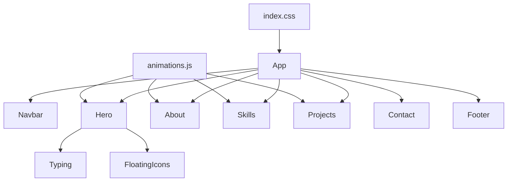

# Design Document — Portfolio Redesign

## Overview

This design covers a senior-level visual and content refresh of Naing Khant's personal portfolio website. The work is scoped to five areas: Hero section typography and entrance animations, About section education correction and polish, Skills section React JS addition, Projects section fourth card addition, and overall CSS polish (spacing, glass-card effects, section transitions, backdrop-filter fallback).

The stack is React + Vite, Framer Motion for animations, react-icons for iconography, and CSS custom properties for theming. No new dependencies are required.

---

## Architecture

The portfolio is a single-page application with a flat component hierarchy. All sections are rendered sequentially in `App.jsx`. Shared animation variants live in `animations.js`. Global styles live in `index.css`.



No state management library is needed. Framer Motion's `whileInView` handles scroll-triggered animations. CSS custom properties handle theming.

---

## Components and Interfaces

### Hero.jsx

Current state: `h1` font-size is 48px (CSS), entrance animation uses `fadeUp` variant (0.8s).

Changes:
- Increase `h1` font-size to **56px** on desktop via CSS (`.hero-content h1`), keeping the existing `span` colored with `var(--primary)`.
- Add a `background: linear-gradient` + `background-clip: text` treatment to the `<span>` wrapping "Naing Khant" to produce the gradient accent using `#38bdf8`.
- The `h3` subtitle keeps `font-weight: 500` (already set) and a smaller size (22px, already set).
- The bio `<p>` gets explicit `opacity: 0.85` (within the 0.75–0.9 range).
- The entrance animation stagger: image animates at `duration: 0.6`, text content at `duration: 0.7` with `delay: 0.3` — total perceived duration ≤1.2s.
- CTA `<a href="#contact">` already present; no change needed.
- Mobile CSS already stacks vertically at `<1024px`; the `<768px` breakpoint will enforce `text-align: center`.

### About.jsx

Current state: displays outdated degree text; Education info is inline in the bio paragraph; no distinct Education_Block.

Changes:
- Remove the outdated degree string from the bio paragraph.
- Add a dedicated `Education_Block` component (inline JSX, not a separate file) rendered below the bio text inside `.about-text`.
- `Education_Block` structure: a `<div className="education-block glass-card">` containing a graduation icon (`FaGraduationCap` from react-icons/fa), the institution name, and the degree.
- Wrap `Education_Block` in a `Motion.div` with `variants={fadeUp}` and `whileInView="show"`.
- Highlight cards already have `transition: transform 0.3s ease` and `translateY(-5px)` on hover — no change needed.
- Padding on `.about-text` is already 40px (≥28px); `.highlight-box` is 30px — bump to 28px minimum confirmed.

### Skills.jsx

Current state: 14 skills in the array; loop duplicates them for the marquee.

Changes:
- Add `{ label: "React JS", Icon: FaReact, color: "#61DAFB" }` to the `skills` array.
- Import `FaReact` from `react-icons/fa`.
- The `loop = [...skills, ...skills]` line already handles duplication — React JS will appear in both halves automatically.
- No other changes needed.

### Projects.jsx

Current state: 3 project cards.

Changes:
- Add a fourth entry to the `projects` array:
  ```js
  {
    title: "Kyaw Kyar Car Showroom",
    desc: "A React JS web application for buying, selling, and promoting cars. Features include vehicle listings, search filters, and dealer contact.",
    tags: ["React JS"],
    link: "#"
  }
  ```
- The existing `stagger` + `fadeUp` animation setup already covers all mapped cards — no animation changes needed.

### index.css

Changes:
1. **Hero h1 font-size**: `56px` on desktop, keep existing responsive breakpoints.
2. **Education_Block styles**: `.education-block` with flex layout, icon color, institution/degree typography.
3. **Glass-card backdrop-filter fallback**: Add `@supports not (backdrop-filter: blur(1px))` block setting `.glass-card`, `.glass`, `.skill-card`, `.project-card` background to `rgba(15, 23, 42, 0.85)`.
4. **Section divider**: Add a subtle `border-top: 1px solid rgba(255,255,255,0.05)` or gradient overlay between alternating sections.
5. **Consistent padding**: Confirm `.section` uses `padding: 100px 10%` on desktop and `80px 5%` on mobile — already present; verify and adjust if needed.
6. **Heading animation duration**: All `whileInView` heading animations use `fadeUp` (0.8s) — within the 0.4s–0.8s range.

---

## Data Models

No external data sources or API calls. All data is static arrays defined within each component.

### Skill entry shape
```ts
{ label: string; Icon: IconType; color: string }
```

### Project entry shape
```ts
{ title: string; desc: string; tags: string[]; link: string }
```

---

## Correctness Properties

*A property is a characteristic or behavior that should hold true across all valid executions of a system — essentially, a formal statement about what the system should do. Properties serve as the bridge between human-readable specifications and machine-verifiable correctness guarantees.*

### Property 1: Hero name font size meets minimum threshold

*For any* desktop viewport (≥1024px), the rendered `h1` element in the Hero section should have a computed font-size of at least 52px.

**Validates: Requirements 1.1**

---

### Property 2: Skills marquee loop contains React JS in both halves

*For any* skills array that contains a "React JS" entry, the duplicated loop array (`[...skills, ...skills]`) should contain "React JS" at least twice — once in each half — so the infinite scroll remains seamless.

**Validates: Requirements 4.3**

---

### Property 3: Projects section always renders all defined project cards

*For any* projects array of length N, the rendered Projects section should contain exactly N project card elements — ensuring no card is silently dropped during the map render.

**Validates: Requirements 5.1, 5.6**

---

### Property 4: About section highlight card count invariant

*For any* render of the About section, the number of `.highlight-box` elements should be greater than or equal to three.

**Validates: Requirements 3.2**

---

### Property 5: Section heading animation duration is within spec range

*For any* section heading animated with Framer Motion's `whileInView`, the transition duration value should be between 0.4 and 0.8 seconds (inclusive).

**Validates: Requirements 6.3**

---

## Error Handling

| Scenario | Handling |
|---|---|
| `backdrop-filter` unsupported (older browsers, Firefox without flag) | CSS `@supports not (backdrop-filter)` fallback sets solid `rgba(15, 23, 42, 0.85)` background — content remains readable |
| Profile image fails to load | `alt="Naing Khant"` attribute ensures accessible fallback text |
| react-icons `FaReact` import missing | Build-time error caught by Vite; fix by adding the import |
| Framer Motion `whileInView` on SSR | Not applicable — Vite SPA, no SSR |

---

## Testing Strategy

### Dual Testing Approach

Both unit tests and property-based tests are required. They are complementary:
- Unit tests catch concrete bugs with specific inputs and verify exact content/attributes.
- Property-based tests verify universal invariants across many generated inputs.

### Unit Tests (Vitest + React Testing Library)

Focus areas:
- **Hero**: Renders with `h1` containing "Naing Khant", CTA `href="#contact"` present, bio `<p>` present.
- **About**: Renders "Myanmar Institute of Information Technology (MIIT)" and "B.E (Hons) Electronics Engineering"; does NOT render the old degree string; Education_Block element exists with an icon.
- **Skills**: Renders a skill card with label "React JS"; the card's icon has color `#61DAFB`.
- **Projects**: Renders exactly 4 project cards; fourth card title is "Kyaw Kyar Car Showroom"; fourth card description contains "buying", "selling", "promoting"; fourth card has tag "React JS"; fourth card link is `href="#"`.
- **CSS variables**: `:root` defines `--primary: #38bdf8`, `--bg-dark: #020617`, `--bg-light: #0f172a`.
- **Backdrop-filter fallback**: `@supports not (backdrop-filter)` block exists in `index.css` with the correct fallback background.

### Property-Based Tests (fast-check)

Use [fast-check](https://github.com/dubzzz/fast-check) for property-based testing. Each test runs a minimum of **100 iterations**.

Tag format: `// Feature: portfolio-redesign, Property {N}: {property_text}`

**Property 1 — Hero name font size**
```
// Feature: portfolio-redesign, Property 1: Hero h1 font-size >= 52px on desktop
```
Generate random viewport widths ≥1024px; for each, assert the CSS rule for `.hero-content h1` resolves to ≥52px. In practice, parse the CSS value directly from the stylesheet rule since jsdom does not compute media queries — assert the raw pixel value in the CSS source is ≥52.

**Property 2 — Skills marquee loop completeness**
```
// Feature: portfolio-redesign, Property 2: React JS appears in both halves of the duplicated skills loop
```
For any skills array containing at least one "React JS" entry, `[...skills, ...skills]` must contain "React JS" at a minimum at index `i` and at index `i + skills.length`.

**Property 3 — Projects render count**
```
// Feature: portfolio-redesign, Property 3: All project cards are rendered
```
Generate random arrays of project objects (length 1–10); render a parameterised Projects component; assert the number of rendered `.project-card` elements equals the array length.

**Property 4 — About highlight card count**
```
// Feature: portfolio-redesign, Property 4: About section renders >= 3 highlight cards
```
Render the About component; query all `.highlight-box` elements; assert count ≥ 3.

**Property 5 — Heading animation duration range**
```
// Feature: portfolio-redesign, Property 5: Section heading animation duration is 0.4–0.8s
```
Inspect the `fadeUp` animation variant's `transition.duration` value; assert it is ≥0.4 and ≤0.8.
